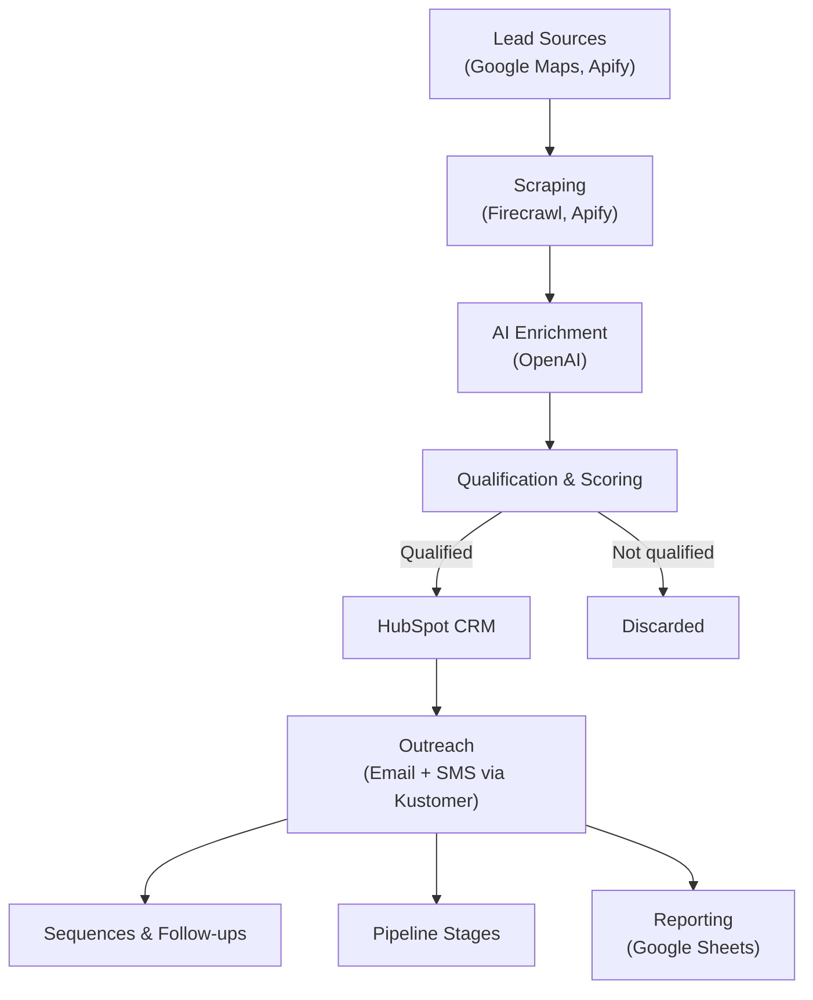

# Pipeline Generation & Outreach System

End-to-end automation system for sourcing, enriching, qualifying, and converting B2B prospects into outbound pipeline.

---

## Overview

This system was designed to replace manual outbound prospecting with a scalable, automated pipeline that continuously generates, evaluates, and routes qualified leads into a CRM.

It integrates scraping tools, AI models, and workflow automation to reduce manual effort and enable consistent, repeatable outbound execution across multiple markets.

The primary goal was to build a system that could continuously generate and process outbound pipeline without manual intervention.

---

## Problem

Outbound acquisition was initially manual and fragmented:

- We detected markets with high levels of demand and low levels of supply
- Prospect research was time-consuming
- Outreach lacked consistency and personalization
- Leads were not systematically tracked

This created bottlenecks in launching outbound efforts and limited the ability to respond to demand signals in target markets.

---

## System Architecture

### Core Components

| Layer | Description |
|---|---|
| Sourcing | Identifies relevant businesses via search-based inputs |
| Extraction | Scrapes website and public data sources |
| Enrichment | Uses AI to structure unstructured data |
| Scoring | Evaluates leads based on ICP criteria |
| Routing | Sends qualified leads into CRM |
| Execution | Triggers outreach and follow-up workflows |

---

## System Behavior

This system operates as a multi-step, event-driven workflow orchestrated through n8n.

- Each stage triggers the next through structured outputs (JSON payloads)
- Data flows between steps via API calls and transformations
- Conditional logic is used to filter, score, and route leads based on defined criteria
- Failures at any step can interrupt downstream processes, requiring retry or manual intervention

The system is designed to run in batches per market, allowing parallel execution across multiple regions.

---

## Workflow Breakdown

### 1. Prospect Sourcing
- Automated sourcing of relevant businesses based on market demand signals

### 2. Data Extraction
- Scraping of websites and public sources
- Preparation of raw data for downstream processing

### 3. AI Enrichment
Structured extraction of:
- Services
- Fleet characteristics
- Pricing signals
- Location and quality indicators

Transforms unstructured content into usable, structured data.

### 4. Qualification & Scoring
- Leads scored against ICP criteria
- Filtering logic to prioritize high-quality prospects

### 5. Personalization
- Dynamic generation of outreach messages using structured data
- Context-aware messaging (services, location, demand signals)

### 6. CRM Integration & Outreach
- Automated lead insertion into CRM
- Triggering of outreach sequences and follow-ups
- Tracking of responses and pipeline stages

---

## Tech Stack

| Category | Tools / Technologies |
|---|---|
| Automation | n8n |
| Integrations | REST APIs, webhooks |
| Data Processing | JSON transformations, structured outputs |
| Data Flow | Structured JSON payloads passed between workflow steps and APIs |
| AI | LLM-based extraction and enrichment |
| Storage / Reporting | Google Sheets, CRM systems |
| Scraping | Web scraping tools (e.g. Firecrawl, Apify) |

---

## Results

- Generated 30–50 qualified prospects per market across multiple U.S. markets  
- Reduced outbound launch time from 1–2 weeks → 1–2 days  
- Enabled onboarding of ~8–12 partners per market  
- Contributed to ~300 net new boats across ~30 markets (2025)  

---

## Reliability & Limitations

This system was built iteratively and surfaced several challenges:

- **Scraping variability:** Website structures required adaptive extraction logic  
- **Data consistency:** AI outputs required normalization and validation  
- **Error handling:** Retry logic is partially implemented at the workflow level, but lacks centralized error handling and fallback paths for failed API calls or incomplete data  
- **State management:** The system does not maintain persistent state across steps, which can lead to duplicated processing or missed records under failure conditions  
- **Coupling:** Certain steps are tightly connected, limiting modularity and flexibility  
- **Monitoring:** Limited observability into failures across long-running workflows  

---

## Future Improvements

- Introduce queue-based processing to decouple steps  
- Implement centralized logging and monitoring  
- Improve retry and fallback strategies  
- Add data validation layers before CRM insertion  
- Modularize workflows into independent, reusable components  

---

## Key Takeaway

This system evolved from a collection of scripts into a loosely-coupled automation pipeline, highlighting the challenges of reliability, observability, and scalability in real-world workflow systems.